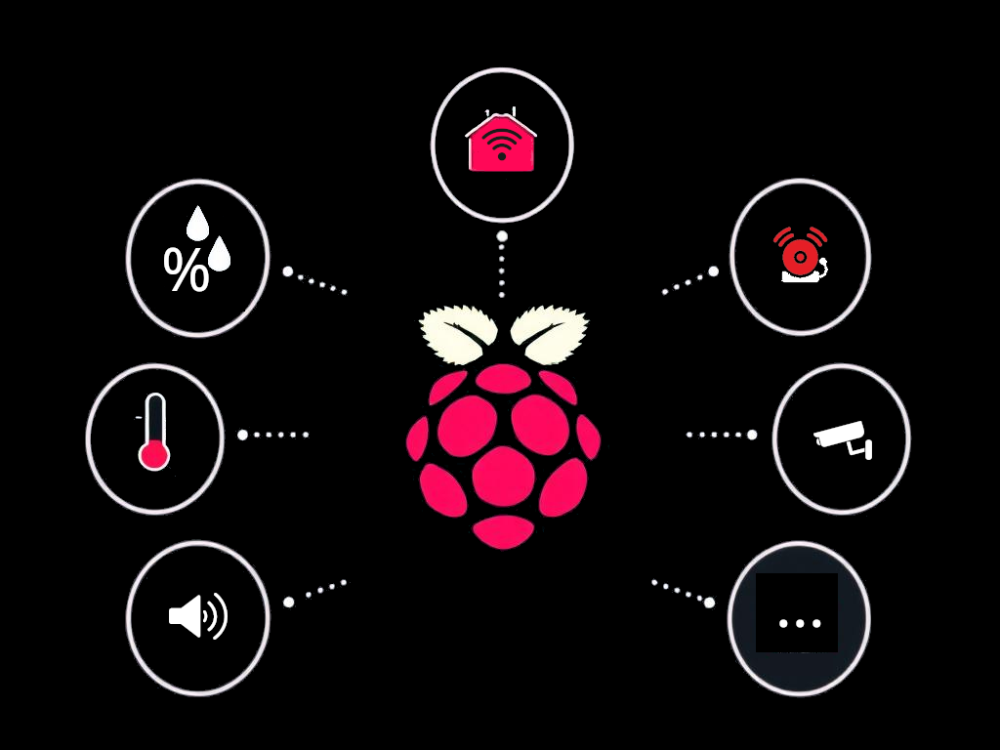

<a id="readme-top"></a>

<!-- PROJECT SHIELDS -->
<!--
*** I'm using markdown "reference style" links for readability.
*** Reference links are enclosed in brackets [ ] instead of parentheses ( ).
*** See the bottom of this document for the declaration of the reference variables
*** for contributors-url, forks-url, etc. This is an optional, concise syntax you may use.
*** https://www.markdownguide.org/basic-syntax/#reference-style-links
-->
[![Issues][issues-shield]][issues-url]
[![MIT License][license-shield]][license-url]
[![LinkedIn][linkedin-shield]][linkedin-url]


<!-- PROJECT LOGO -->
<br />
<div align="center">
  <a href="https://code.manhart.space/manuelmanhartit/raspi-controller">
    
  </a>

  <h3 align="center">Raspi-Controller</h3>

  <p align="center">
    This is Raspi-Controller, home automation made for easy plug and play.
    <br />
    <a href="https://code.manhart.space/manuelmanhartit/raspi-controller/issues/new">Create issue</a>
  </p>
</div>

<!-- TABLE OF CONTENTS -->
<details>
  <summary>Table of Contents</summary>
  <ol>
    <li>
      <a href="#about-the-project">About The Project</a>
      <ul>
        <li><a href="#built-with">Built With</a></li>
      </ul>
    </li>
    <li>
      <a href="#getting-started">Getting Started</a>
      <ul>
        <li><a href="#prerequisites">Prerequisites</a></li>
        <li><a href="#installation">Installation</a></li>
      </ul>
    </li>
    <li><a href="#usage">Usage</a></li>
    <li><a href="#roadmap">Roadmap</a></li>
    <li><a href="#contributing">Contributing</a></li>
    <li><a href="#license">License</a></li>
    <li><a href="#contact">Contact</a></li>
    <li><a href="#acknowledgments">Acknowledgments</a></li>
  </ol>
</details>

<!-- ABOUT THE PROJECT -->
## About The Project

[![components diagram][product-components-diagram]][issues-url]

I have a homeassistant installation running on a server. For integrating multiple sensors and other stuff (like multiroom audio) I needed a solution. Since I already had some old Raspberry PIs lying around from old projects I thought I could use them. I started with a small project for reading a DHT22 for temperature & humidity, but with the upgrade to bookworm it failed due to deprecated libraries.

Also it was only taking care of temperature but nothing else and it was not very flexible / configurable. So I created a solution which I could extend easily and came up with this thing I call Raspi-Controller.

In my first attempt I used REST via fastapi (for easy access) but it showed that this only works good on a raspberry pi 2 or newer. But I wanted compatibility to raspberry pi 1 as well, so I took a step back, removed the whole REST part and started thinking about mqtt for output and accessing the pi.

<p align="right">(<a href="#readme-top">back to top</a>)</p>

### Built With

* [![Python][Python]][Python-url]
* [![Bash][Bash]][Bash-url]

<p align="right">(<a href="#readme-top">back to top</a>)</p>

<!-- GETTING STARTED -->
## Getting Started

To get a local copy up and running follow these simple example steps.

### Prerequisites

Linux and a bash / sh terminal.

### Installation

You just need to call the following bash script and it will guide you through the setup and install all neccessary dependencies:

```sh
./run.sh
```

<p align="right">(<a href="#readme-top">back to top</a>)</p>

<!-- USAGE EXAMPLES -->
## Usage

This software was built to brigde to different IOT hardware and make them available to the raspberry pi as plug and play components. Also to power a homeautomation system like homeassistant via mqtt.

The features are

* Binary Sensors (low / high) like Reedswitches or PIR sensors - for intruder alert, motion detection,...
* Cameras - so you can see what is going on even when not at home
* Healthcheck - you can get healthcheck information on the Raspberry PI like temp, cpu, mem, disk usage,...
* IP Address - if your router sometimes changes IP Addresses (via DHCP), you can feed a DNS server (like unbound) always with current name & ip address combinations
* Led - power LEDs on incoming MQTT messages
* Readonly mode - so the Raspberry PI is more resilient to power outages / issues
* Squeezebox / Musicbox - For Multiroom Audio and as well so everyone can listen to their music easily
* Temperature And Humidity Sensors - To track the environment of your house / flat
* (Software) Update Service - So the Raspberry PI always stays up to date as well as Raspi-Controller itself

### Logging

By default the logging is written to stdout. The log levels are configured via `config.yaml` file. The default logging config is:

```yaml
  logging:
    active: True
    default: INFO
```

This means that logging will be made, and that the default level is INFO. 

The loglevels are:

```
DEBUG
INFO
WARN
ERROR
```

and eg. INFO will log the levels from INFO on to the last level (ERROR).

You can override levels for your service like this:

```yaml
  logging:
    active: True
    default: INFO
    mqtt: DEBUG
```

That additional line means that for the mqtt service we want to have additional logging so we can see what is happening inside the logic of this service.

This is common in software craftmanship and made so we do not flood the logs with debug messages (but log them when / where neccessary).

### Reading MQTT Sensor Values

1. Install an MQTT broker on a server
2. Configure raspi-controller to use this as its broker (in `config.yaml`)
3. Start raspi-controller (via run.sh) to see in the logs to which topic the sensor will write to
4. Subscribe to the according topic in your software of choice (eg. homeassistant)

### Squeezeboy / Musicbox / Multiroom Audio

The squeezebox service is currently only a read on the state of the linux service

Currently it needs to be installed manually but it will be integrated in a future release (into bash)

### Temperature & Humidity Sensor

This is written for DHT22, but you can use DHT11 or AM2302 as well.

1. Connect to 3.3V, GPIO 4, GND with a fitting cable
2. Then configure the yaml file (section `temperature`)

### PIR Sensor

1. Connect to 5V, GPIO 23, GND with a fitting cable
2. Then configure the yaml file (section `binarySensor`)
3. Set the potmeters on the PIR sensor accordingly

Also see [understand the two potentiometers on a PIR sensor][pir-two-pot] or [connect a PIR sensor to the raspberry pi (German)][pir-two-pot-de]

<p align="right">(<a href="#readme-top">back to top</a>)</p>

## Changelog

**1.1.0 - WIP**
* Refactored `LoggingService` to change loglevel via config file

**1.0.0**
* Switched to [Semantic Versioning 2.0.0](https://semver.org/)
* Refactored services into
  * base services (always in the system and usually global)
  * modular services (should be downloaded in the future on the fly only when used / installed)
* Switched to an mqtt only approach instead of providing REST services
* Added hasSignificantChange function to sensor service (for immediate updates if sensor data changed significantly)
* Extended bash scripts
* Implemented `BinarySensorService` for  all sensors (eg. pir, reed,...) where we just read a low / high state
  * Can be configured / used with multiple sensors

**0.5**
* Moved default_config.yaml file to project root
* Moved installService.sh to a more generic service.sh file
* Updated all services
* Added support for environment variables within the config file
* Moved config loader to global config class

**0.4**
* Refactoring of base service
* Added config loader

**0.3**
* Added camera and readonly service

**0.2**
* Added update service, squeezebox and temperature service

**0.1**
* Initial web service api

<p align="right">(<a href="#readme-top">back to top</a>)</p>

## Roadmap

- [ ] Sending logging also via `$baseOutTopic/$hostname/logging`
- [ ] Implement CameraService
- [ ] Implement ReadonlyService
- [ ] Get the config via MQTT and save the configuration into `config.yaml` file
- [ ] Merge the configs read from `default_config.yaml` and `config.yaml` so one only needs to override the changes instead of copying all
- [ ] Read incoming mqtt messages and forward them to the correct service

See the [open issues](https://code.manhart.space/manuelmanhartit/raspi-controller/issues) for a full list of proposed features (and known issues).

<p align="right">(<a href="#readme-top">back to top</a>)</p>

<!-- CONTRIBUTING -->
## Contributing

Contributions are what make the open source community such an amazing place to learn, inspire, and create. Any contributions you make are **greatly appreciated**.

If you have a suggestion that would make this better, please fork the repo and create a pull request. You can also simply open an issue with the tag "enhancement".
Don't forget to give the project a star! Thanks again!

1. Fork the Project
2. Create your Feature Branch (`git checkout -b feature/AmazingFeature`)
3. Commit your Changes (`git commit -m 'Add some AmazingFeature'`)
4. Push to the Branch (`git push origin feature/AmazingFeature`)
5. Open a Pull Request

<p align="right">(<a href="#readme-top">back to top</a>)</p>

<!-- LICENSE -->
## License

Distributed under the MIT License. See [LICENSE.md][license-url] for more information.

<p align="right">(<a href="#readme-top">back to top</a>)</p>

<!-- CONTACT -->
## Contact

Manuel Manhart - [@manuel.manhart](https://twitter.com/ManuelManhart) - manuel.manhart@gmail.com

<p align="right">(<a href="#readme-top">back to top</a>)</p>

<!-- MARKDOWN LINKS & IMAGES -->
<!-- https://www.markdownguide.org/basic-syntax/#reference-style-links -->
[issues-shield]: https://img.shields.io/badge/open-issues-yellow?style=for-the-badge
[issues-url]: https://code.manhart.space/manuelmanhartit/raspi-controller/issues
[linkedin-shield]: https://img.shields.io/badge/-LinkedIn-black.svg?style=for-the-badge&logo=linkedin&colorB=555
[linkedin-url]: https://linkedin.com/in/manuel-manhart
[license-shield]: https://img.shields.io/badge/license-mit-blue?style=for-the-badge
[license-url]: https://code.manhart.space/manuelmanhartit/raspi-controller/src/branch/main/LICENSE.md
[product-screenshot]: docs/screenshot.png
[product-components-diagram]: docs/components-diagram.png
[Python]: https://img.shields.io/badge/python-000000?logo=python&style=for-the-badge&
[Python-url]: https://python.org/
[Bash]: https://img.shields.io/badge/Bash-20232A?logo=gnubash&style=for-the-badge&
[Bash-url]: https://bash.org/
[pir-two-pot]: https://forum.arduino.cc/t/help-me-to-understand-the-two-potmeters-on-my-pir-sensor/372895
[pir-two-pot-de]: https://tutorials-raspberrypi.de/raspberry-pi-bewegungsmelder-sensor-pir/
